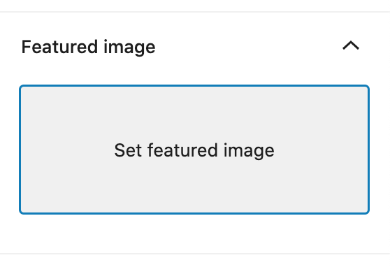
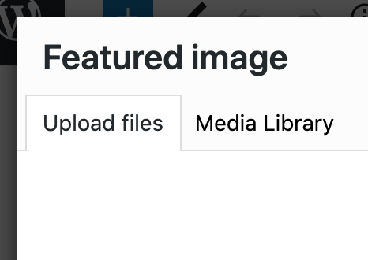
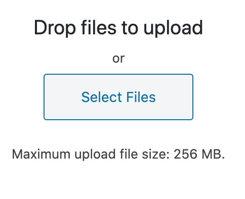

# Dancers

To add a dancer to the [dancers page](https://www.nimbusdance.org/dancers/), click on "dancers" then "add new".

---

Add a feature image - this should be the photo of the dancer. In the right side bar click on "set feature image", then the "upload files" tab, then "select file" and choose the image you have on your computer that you'd like to use.

---

The title should be the dancer's name and their biography in the main text editor.

---

The surname is used to order the dancers on the dancers page by ascending surname.

---

If the dancer is "Nimbus2",  click on the nimbus2 category on the right hand side:

