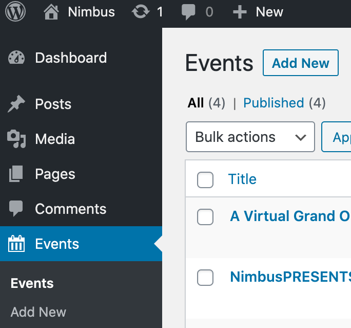
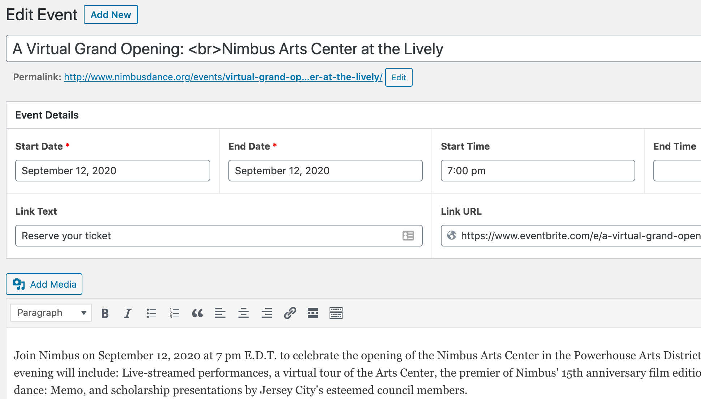

# Events

To add events to the [calendar/event listing page](https://www.nimbusdance.org/events/), click on "events" then "add new".

Enter all the event details, including title, date, times, link and description.

Click on "Publish" and you should now see the event listed in the [calendar](https://www.nimbusdance.org/events/) and included in "upcoming events" on the [home page](https://www.nimbusdance.org/).