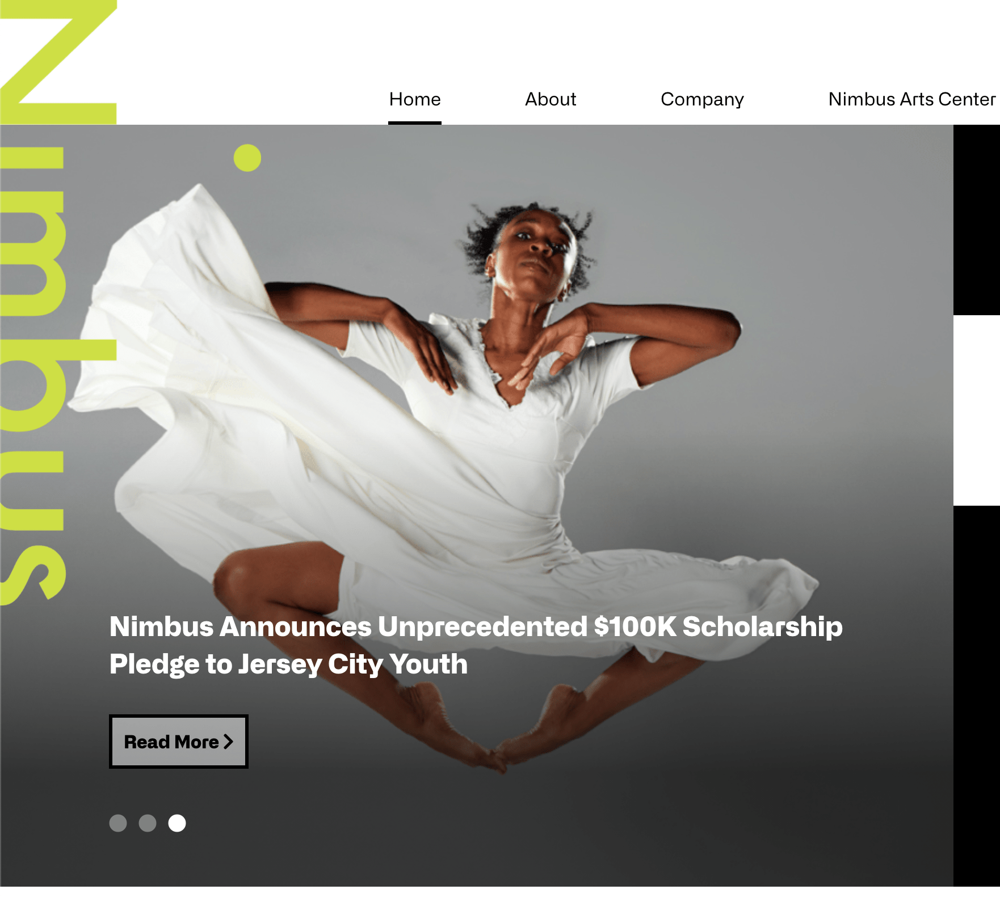
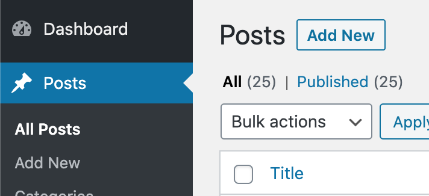
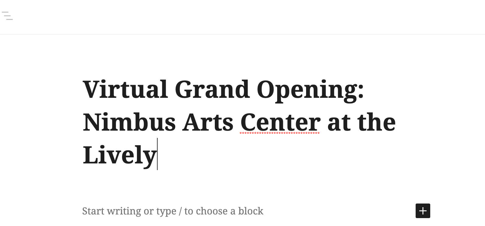
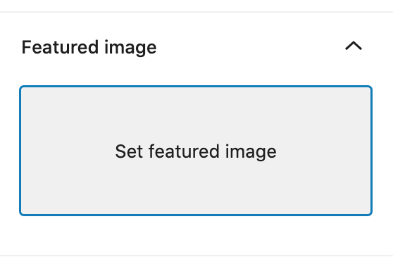
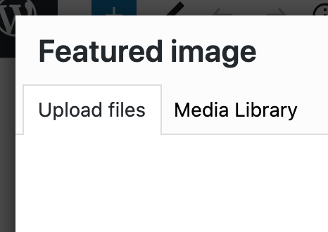
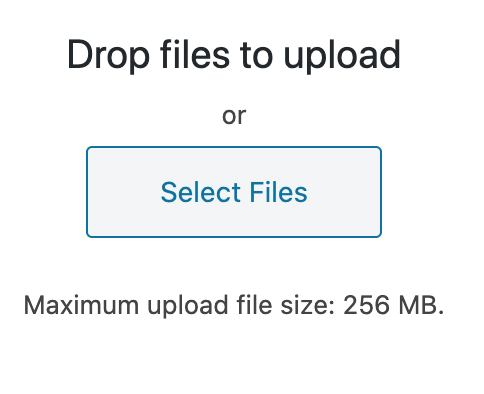
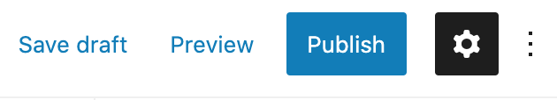
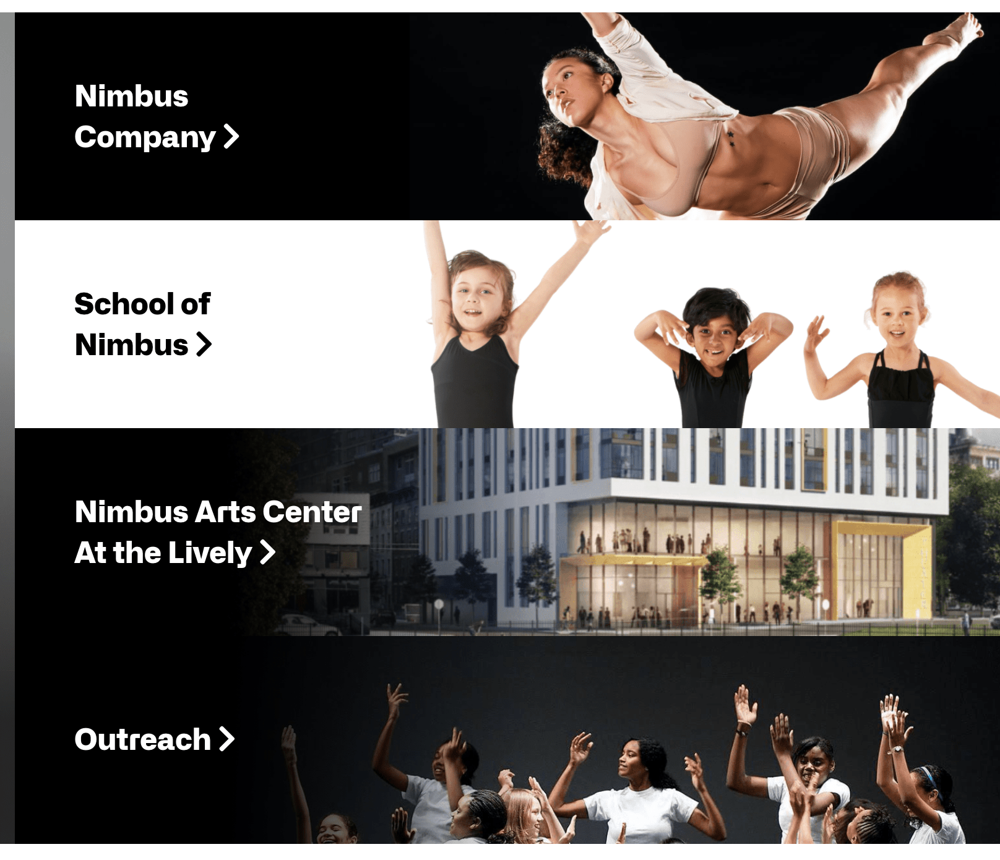

# The Home Page

Content for various sections of the home page can be updated with custom content.

## Headline Article Slider
The slider on the top left hand side of the home page consists of all posts with the category "headline".

### Adding a headline article
- In the Wordpress dashboard Click on "Posts" in the left sidebar and "add new"

  

- Enter the title - this is the text that will appear on the home page.

  

- Add a feature image - this image will appear as the backdrop image on the home page. In the right side bar click on "set feature image", then the "upload files" tab, then "select file" and choose the image you have on your computer that you'd like to use.

  
  
  

- Finally press "Publish" in the top right corner and the content should now appear in the home page slider.
- 
  

## Headline Pages
There are 4 pages listed in the top right hand corner of the home page:

At present, these can only be adjusted by a WordPress theme developer. In future we will set this up so that the Wordpress admin can choose which four pages are listed there.

## Upcoming Events

This section shows the three latest scheduled events (whether in the past or future) that are in the calendar. You don't need to do anything with this section, it will automatically pick up the 3 most recent events.