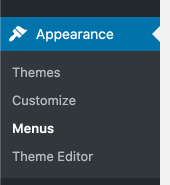

# Menus

There are three menu areas on the site:
- Main navigation 
- Footer menus for desktop
- Simplified footer menu for mobile
  
## Main navigation menu

This is the main menu running across the top of the website. Its appearance changes for mobile devices to maintain usability.

### Desktop

### Mobile

---

## Footer menus - desktop

There are 6 menus representing a site map along with social media links.

---

## Footer menus - mobile

A very simplified version of the desktop footer links - just the main pages.

---

## Changing menu items

The process is the same to change the links in all of the menus mentioned above: 
Go to "Appearance", "Menus"

Select which menu you want to edit and click on "select":

On the left hand side, select which page/post you want to add, then press "add to menu"

The menu item will be added to the right (at the bottom) - you can then drag it to wherever you want it to appear.

