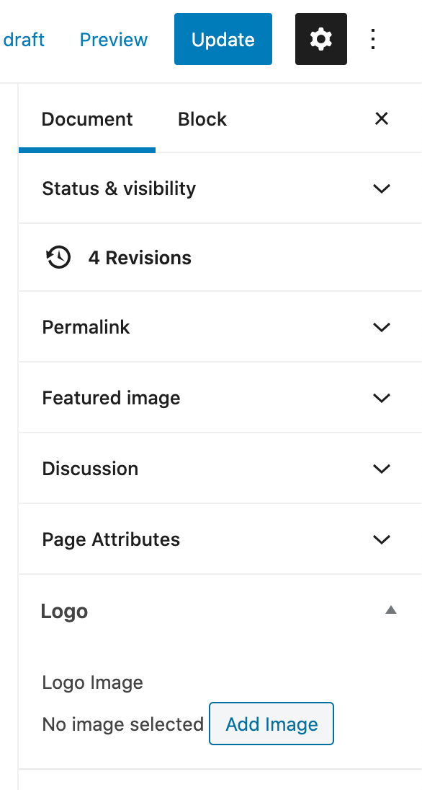

# Pages

The following six pages cannot currently be changed by a Wordpress admin due to their highly customised and unique styling. Any changes to these need to be requested through a developer for now. In future, this can potentially be changed so that content will be editable within WordPress.

- [Home](https://www.nimbusdance.org/) 
- [About](https://www.nimbusdance.org/about/)
- [Nimbus Arts Center](https://www.nimbusdance.org/nimbus-arts-center/)
- [Support](https://www.nimbusdance.org/support/)
- [School of Nimbus](https://www.nimbusdance.org/school-of-nimbus/)
- [Outreach](https://www.nimbusdance.org/outreach/)

All other pages can be added/edited/deleted easily via WordPress using the process below.

## Creating & editing

To add pages, you can use the standard process which is documented by WordPress here: [wordpress.org/support/article/pages](https://wordpress.org/support/article/pages/).

## Adding a page to a menu

To add a new page to any of the menus, following the process for [adding menu items](../menus/#changing-menu-items).

## Changing the logo colour

By default, the logo colour is green. If you want the logo in a different colour for a specific page, you can choose another image. Go to the editor for the relevant page, then on the right sidebar click "Add image" under the "Logo" section. 

Please note, the image you use should be in "png" format and should be the vertical Nimbus logo with a transparent background and the text in any colour. If you don't choose an image, the default green logo is used.