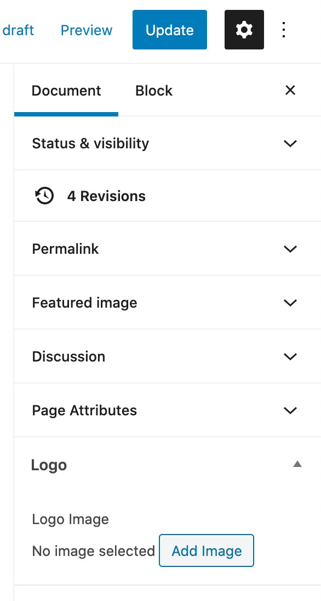

# Posts

There are five categories of posts, each category is related to different pages. These pages typically contain a list or group of the posts with the relevant category. The categories are:

`headline` posts are displayed in the top left section of the [home page](https://www.nimbusdance.org)
  
`visual-arts` posts are displayed as images in the visual arts slider on the [nimbus-arts-center page](https://www.nimbusdance.org/nimbus-arts-center/)

`community-projects` posts are linked to within the [outreach page](https://www.nimbusdance.org/outreach/)

`scholarship` is the category of a single post containing the scholarship pledge, the [outreach page](https://www.nimbusdance.org/outreach/) automatically links to this content

`sponsor` posts are shown as logo images at the bottom of the [support page](https://www.nimbusdance.org/support/)

## Creating & editing

To add posts, you can use the standard process which is documented by WordPress here: [wordpress.org/support/article/wordpress-editor](https://wordpress.org/support/article/wordpress-editor/).

## Adding a post to a menu

To add a new post to any of the menus, following the process for [adding menu items](../menus/#changing-menu-items).

## Changing the logo colour

By default, the logo colour is green. If you want the logo in a different colour for a specific post, you can choose another image. Go to the editor for the relevant post, then on the right sidebar click "Add image" under the "Logo" section. 

Please note, the image you use should be in "png" format and should be the vertical Nimbus logo with a transparent background and the text in any colour. If you don't choose an image, the default green logo is used.